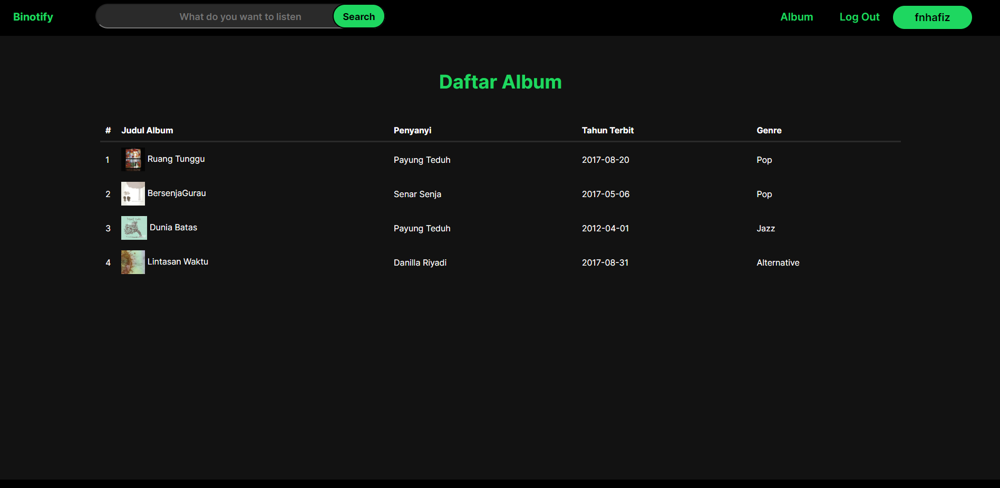

# Tugas Besar IF3110-2022-K03-01-47: Binotify

## Anggota Kelompok
- Farhan Hafiz - 13520027
- Ilham Bintang Nurmansyah - 13520102
- Haidar Ihzaulhaq - 13520150
## Dekripsi Applikasi Web
Aplikasi website Binotify adalah aplikasi web yang digunakan untuk mengengarkan lagu. Aplikasi ini memiliki fitur-fitur yang dapat digunakan untuk mengelola lagu. Fitur-fitur yang tersedia pada web ini adalah:
- Login/Register
- Masuk sebagai guest
- Melihat daftar lagu/album
- Melihat detail lagu/album
- Mencari lagu/album
- Untuk user yang terverifikasi sebagai Admin dapat:
    - Menambah lagu/album
    - Mengedit lagu/album
    - Menghapus lagu
    - Melihat daftar user
    - Melihat daftar lagu/album
    - Melihat detail lagu/album
    - Mencari lagu/album
    - Memutar lagu
- Untuk user yang terverifikasi senagai User dapat:
    - Melihat daftar lagu/album
    - Melihat detail lagu/album
    - Mencari lagu/album
    - Memutar lagu

## Daftar Requirement
1. Docker Latest Version

## Cara instalasi dan menjalankan website
1. Pastikan sudah terinstall docker dan docker-compose
2. Clone repository ini
3. Masuk ke folder repository
4. Jalankan perintah `docker-compose up`
5. Aplikasi PHP akan berjalan di port 8000
6. Aplikasi MySQL akan berjalan di port 3306
7. Aplikasi PHPMyAdmin akan berjalan di port 8080
8. Import database hasil dump yang ada di folder sql ke PHPMyAdmin
9. Download file lagu di link <a href="https://drive.google.com/drive/folders/1JHtpVVcuyp7r_7deqlJhWuPg_5FNpT3Z?usp=sharing">berikut  </a>dan letakkan semua file lagu tersebut pada `./src/assets/audio`
10. Untuk login sebagai admin dapat menggunakan akun dengan username `hambinn` dengan password `12345678`
11. Jalankan perintah `docker-compose down` untuk mengakhiri web

## Screenshot Tampilan Aplikasi
- Login

- Register (Fail)

- Register (Success)

- HomePage (Guest)

- HomePage (User)

- HomePage (Admin)

- Daftar Album

- Search (1)

- Search (2)

- Detail Lagu (Guest)

- Detail Lagu (User)

- Detail Lagu (Admin)

- Detail Album (User)

- Detail Album (Admin)

- Tambah Album

- Tambah Lagu

- Daftar User

## Pembagian Tugas
Server Side :
- Login : 13520150
- Register : 13520150
- Home : 13520027
- Daftar Lagu : 13520027
- Daftar Album : 13520102
- Search, Sort, Filter : 13520027
- Detail Lagu : 13520150
- Detail Album : 13520102
- Tambah Album/Lagu : 13520102
- Daftar User : 13520150
- Navbar : 13520027, 13520102, 13520150

Client Side :
- Login : 13520150
- Register : 13520150
- Home : 13520027
- Daftar Lagu : 13520027
- Daftar Album : 13520102
- Search, Sort, Filter : 13520027
- Detail Lagu : 13520150
- Detail Album : 13520102
- Tambah Album/Lagu : 13520102
- Daftar User : 13520150
- Navbar : 13520027, 13520102, 13520150

Design MockUp : 13520027  
Docker        : 13520102  
Database      : 13520150  